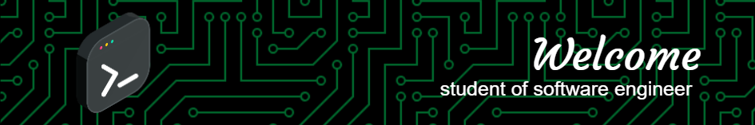

### fun Presentation ()
### {
#### Hi, my name is : **Angel**
#### i'm : **19 years old**
#### _i'm currently student_
### }

### fun Skills ()
### {
#### 🖥️ Programming languages & html:
 &nbsp;
 &nbsp;
 &nbsp;
 &nbsp;
 &nbsp;
 &nbsp;
 &nbsp;
 &nbsp;
 &nbsp;

#### 📚 Frameworks, platforms & libraries:
 &nbsp;
 &nbsp;
 &nbsp;
 &nbsp;

#### ⚙ DataBase:
 &nbsp;

#### ☁️ Cloud & Hosting:
 &nbsp;

#### 🎨Design:
 &nbsp;
 &nbsp;
 &nbsp;

### }
### fun Tools ()
### {
#### 🛠️ Tools:
 &nbsp;
 &nbsp;
 &nbsp;

#### 📖 IDE's:
 &nbsp;
 &nbsp;
 &nbsp;
 &nbsp;

#### 📒 some knowledge :
 &nbsp;
 &nbsp;
 &nbsp; 

### }

### fun SocialNetworks ()
### {
#### 💻 SocialNetworks:
 &nbsp;
 &nbsp;

### }

  

